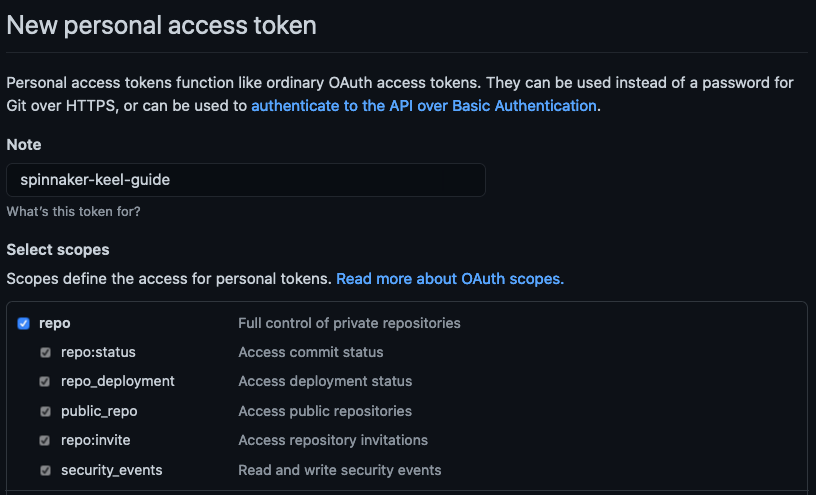
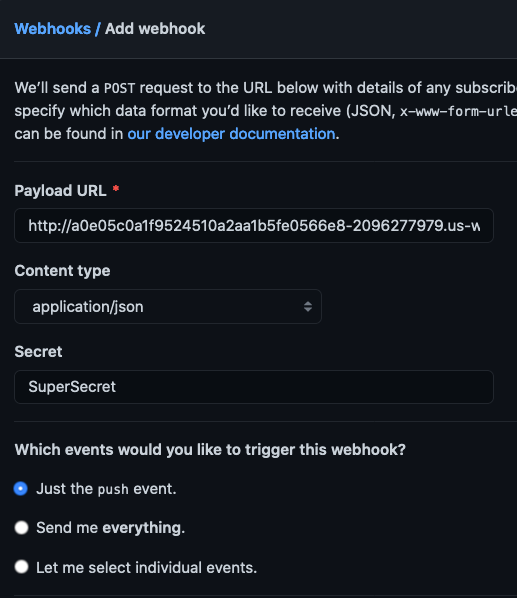
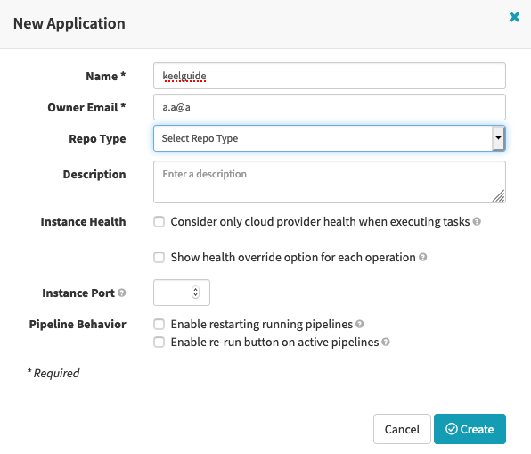
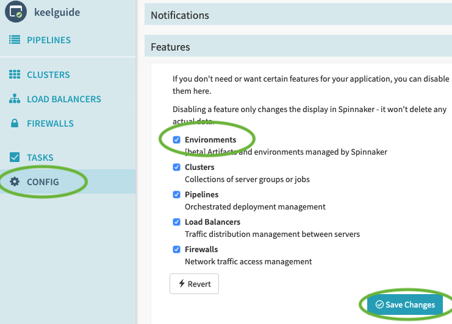

# How to deploy Spinnaker Keel on Amazon EKS


Originally open sourced by Netflix in 2015, Spinnaker is a continuous delivery platform for releasing software changes rapidly and reliably. Spinnaker provides the flexibility to deploy applications on virtual machines running in the cloud or in your container platform of choice, such as [Amazon Elastic Container Service (Amazon ECS)](https://aws.amazon.com/ecs/) or [Amazon Elastic Kubernetes Service (Amazon EKS)](https://aws.amazon.com/eks/). 


Keel is an optional microservice of Spinnaker that enables the GitOps experience. This happens by allowing users to declaratively define their desired end state of infrastructure resources and software components as the source of truth. Keel then reconciles the state of the deployed software to match the end state defined by users. Note that Keel is not a complete replacement for Spinnaker pipelines. [Keel is an alternative to traditional Spinnaker pipeline](https://github.com/spinnaker/keel/blob/master/FAQ.md#does-this-mean-that-pipelines-will-be-deprecated) with a focus on what users want to deploy, not how to get there.

In this post, we’ll walk through the process of deploying Spinnaker core microservices and Keel to a Kubernetes cluster and then deploying a sample Kubernetes application using Keel.

## Setup

In this post, we will walk you through the follow steps:

* Set up an Amazon EKS cluster.
* Generate Spinnaker configuration files using Kleat.
* Create and customize Kubernetes Kustomization files for Spinnaker microservices.
* Run Spinnaker with Keel on the Amazon EKS cluster.
* Create and run an example Kubernetes service and deployment using Keel.

## Prerequisites

* An [AWS account](https://signin.aws.amazon.com/signin?redirect_uri=https%3A%2F%2Fportal.aws.amazon.com%2Fbilling%2Fsignup%2Fresume&client_id=signup)
* A GitHub account
* A Docker Hub account
* The following tools need to be installed:
    * [The AWS Command Line Interface (AWS CLI)](https://docs.aws.amazon.com/cli/latest/userguide/install-cliv2.html)
    * [Kubernetes CLI (kubectl)](https://kubernetes.io/docs/tasks/tools/install-kubectl/)
    * [eksctl](https://docs.aws.amazon.com/eks/latest/userguide/getting-started-eksctl.html)
    * [kleat](https://github.com/spinnaker/kleat/releases) 

## Setting up Spinnaker 

### Clone the GitHub repository

Run the following command to clone the setup repository to your local machine.

```
git clone https://github.com/aws-samples/spinnaker-keel-on-eks.git && cd keel-setup-guide
```


The commands used in the rest of this post are run from this repository’s root. 

### Set up an Amazon EKS cluster 

Open `eks/cluster.yaml` in a text editor and examine the configuration options. It instructs eksctl to create the following resources:

* An Amazon EKS cluster named “keel-guide” in the **us-west-2** region.
* An Amazon EKS managed node group, which will run Spinnaker workload.
* Kubernetes service accounts with IAM roles associations for the Front50 microservice.

Create an Amazon EKS cluster by running the following command. Note that the `--profile` flag specifies which AWS CLI [named profile](https://docs.aws.amazon.com/cli/latest/userguide/cli-configure-profiles.html) to use. 

```
eksctl --profile default create cluster -f eks/cluster.yaml
```

### Set up an Amazon Simple Storage Service (Amazon S3) bucket

Spinnaker requires a persistent storage location to store its applications and pipeline information. Various options are supported but we use Amazon S3 in this guide. Follow one of the options in [this page](https://docs.aws.amazon.com/AmazonS3/latest/userguide/create-bucket-overview.html) to create an S3 bucket in the us-west-2 region. 

Open `halconfig.yaml` file and update the `persistentStorage.s3.bucket` field with the name of the bucket you just created.

### Create a Kubernetes service account 

We will use the Kubernetes cluster we created earlier to deploy Docker images for our example application. Run the following commands to create a service account and generate a `kubeconfig` file for Spinnaker to deploy Kubernetes resources. If you do not want to grant access to all namespace, follow [this Armory’s guide.](https://docs.armory.io/docs/armory-admin/manual-service-account/#grant-namespace-specific-permissions\) 

```
kubectl create ns spinnaker
kubectl apply -f eks/deploy-sa.yaml
eks/createKubeconfig.sh
```

Run the following command to verify the newly generated `kubeconfig` file works. If it is generated correctly, it should return pods in all namespaces.

```
kubectl --kubeconfig spinnaker-config/overlays/keel/secrets/kubeconfig-deploy get pods -A
```

### Deploy Spinnaker with Keel

Run the following command to make `kleat` generate configuration files for Spinnaker microservices. 

```
kleat generate halconfig.yml spinnaker-config/base/kleat
```

The command above generates configuration files for each Spinnaker microservice under the `spinnaker-config/base/kleat` directory. These files are mounted as Kubernetes secrets on respective Spinnaker microservice pods. 

Run the following command to deploy Spinnaker with Keel using `kustomize`.

```
kustomize build spinnaker-config/overlays/keel | kubectl apply -f -
```

The above command creates the following deployments in your cluster:

* [Spinnaker microservices](https://spinnaker.io/reference/architecture) with Keel. 
* Redis.
* MySQL, which is used by Keel to store application state information such as artifacts and environments. 

Wait for the Kubernetes resources to finish deploying. It should take ~10 minutes for everything to deploy. You can verify it by running the following command.

```
kubectl -n spinnaker get deployments
```

When it’s done deploying, it should display all deployments in ready state.

### Redeploy Spinnaker with accessible UI

Next, we need to redeploy Spinnaker and make Spinnaker aware of loadbalancer URL to access the UI. 

In `halconfig.yml` , navigate to `security.apiSecurity.overrideBaseUrl` . Replace the placeholder value with the value returned by the following command:

```
kubectl -n spinnaker get svc gate -o jsonpath='{.status.loadBalancer.ingress[0].hostname}'
```

In the same file, navigate to `security.uiSecurity.overrideBaseUrl` . Replace the place holder value with the value returned by the following command:

```
kubectl -n spinnaker get svc deck -o jsonpath='{.status.loadBalancer.ingress[0].hostname}'
```

Note that the follow steps will expose your Spinnaker UI to the world, and it should be used for testing purposes only. If you would like to restrict access based on IP range, add `spec.loadBalancerSourceRanges` to gate and deck services. See `spinnaker-config/overlays/keel/patch-gate.yml` and `spinnaker-config/overlays/keel/patch-gate.yml` for more details.

Redeploy Spinnaker:

```
kleat generate halconfig.yml spinnaker-config/base/kleat
kustomize build spinnaker-config/overlays/keel | kubectl apply -f -
```

Wait for new pods to finish deploying and verify that the new pods are deployed.

```
kubectl -n spinnaker rollout status deployment 
kubectl -n spinnaker get pods 
```

Once new pods are ready, navigate to the address returned by `kubectl -en spinnaker get deck gate -o jsonpath='{.status.loadBalancer.ingress[0].hostname}'` 
You should see the Spinnaker UI with an empty list of applications. 


## Create a Keel-enabled application 

The Spinnaker deployment does not have any applications in it. Let’s create a sample application with the following configuration features:

* Consists of a Kubernetes service and deployment.
* New container images are automatically deployed.
* Rollback changes when the container image is bad.

### Create a GitHub repository

Spinnaker needs a Git repository to store application delivery configuration information. Create a repository by following [GitHub’s guide.](https://docs.github.com/en/github/getting-started-with-github/create-a-repo)

### Create a GitHub token

Spinnaker needs to be able to pull application delivery configuration from the repository. GitHub requires an access token to retrieve repository information. 

1. Create an [access token](https://github.com/settings/tokens) for GitHub and assign the **repo** scope. 
 
2. Open the `halconfig.yml` file in the text editor of your choice. 
3. Navigate to `artifacts.github.enabled` and set the value to `true`.
4. Navigate to `artifacts.github.accounts`. Replace the placeholder token value `<TOKEN>` with the access token generated in step 1. 
5. Open `spinnaker-config/overlays/keel/secrets/igor-local.yml` in a text editor. 
6. Update the `accessToken` field with the token generated in step 1.


### Create a GitHub Webhook 

We need to notify Spinnaker when there is a change to the repository. We will use GitHub’s webhook capability for this guide. 

1. Go to your repository’s settings page. 
2. Go to settings and click *Add webhook*.

    

3. In the webhook configuration page, specify the Spinnaker webhook URL, `http://${GATE_URL}/webhooks/git/github` .
    The `GATE_URL` value can be found by running `kubectl -n spinnaker get svc gate -o jsonpath='{.status.loadBalancer.ingress[0].hostname}'`
4. Select `application/json` as the context type.

    

5. Click the *Add Webhook* button to finish creating webhook.


### Configure a Docker Hub repository

We will also create a public Docker Hub repository to pull available images for deployment.

1. Create a public Docker Hub repository by [following this guide](https://docs.docker.com/docker-hub/repos/). 
2. Create an image to use for our example application. Be sure to replace `<CHANGEME>` with your repository name.

    ```
    docker build -t <CHANGEME>:0.0.1 .
    docker push <CHANGEME>:0.0.1
    ```

3. In `halconfig.yml` navigate to `providers.dockerRegistry.accounts`. Replace `REPO_NAME` with your repository name you just created. 
4. In the same file, set `providers.dockerRegistry.enabled` value to `true`.


### Reconfigure Spinnaker microservices

1. Run the following command to make `kleat` regenerate configuration files for Spinnaker microservices: 

    ```
    kleat generate halconfig.yml spinnaker-config/base/kleat
    ```

2. Redeploy Spinnaker to apply configuration changes:

    ```
    kustomize build spinnaker-config/overlays/keel | kubectl apply -f -
    ```

3. Check deployment status with the following command:

    ```
    kubectl -n spinnaker get pods
    ```

### Create a service account

Keel needs a Spinnaker service account to manage delivery configurations for the sample application. 

1. Port forward the Front50 service by running the following command:

    ```
    kubectl -n spinnaker port-forward svc/front50 8080
    ```

2. In a different terminal session, run the following command to create a service account:

    ```
    curl -X POST \
      -H "Content-type: application/json" \
      -d '{ "name": "keeldemo-service-account", "memberOf": [] }' localhost:8080/serviceAccounts
    ```

3. Verify the account was created:

    ```
    curl localhost:8080/serviceAccounts
    ```

### Create an application

Navigate to the Applications tab and click on the create application button. Enter an application name and an email address. The email address does not need to be valid.



Once the application is created, click on the config tab, check the *Environments* checkbox, and *Save Changes*.



### Create a sample pipeline

Go to the Pipelines tab on the left, click *create pipeline*, enter a name for the pipeline, then click *create*. Click the *Pipeline Actions* button on the upper right,and then select *Edit as JSON*. 


In the new window, paste the following. Be sure to update the following values:

* The slug field should reference your GitHub repository name. For example, use `clouddriver` for `github.com/spinnaker/clouddriver`
* The project field should reference your GitHub user name or organization name. For example, use `spinnaker` for `github.com/spinnaker/clouddriver`
* The secret value must match the secret value specified when creating the webhook for the pipeline.  

```
{
  "appConfig": {},
  "expectedArtifacts": [],
  "keepWaitingPipelines": false,
  "lastModifiedBy": "an",
  "limitConcurrent": true,
  "spelEvaluator": "v4",
  "stages": [
    {
      "name": "Import Delivery Config",
      "refId": "2",
      "requisiteStageRefIds": [],
      "type": "importDeliveryConfig"
    }
  ],
  "triggers": [
    {
      "branch": "main",
      "enabled": true,
      "expectedArtifactIds": [],
      "project": "CHANGEME",
      "runAsUser": "keeldemo-service-account",
      "secret": "SuperSecret",
      "slug": "CHANGEME",
      "source": "github",
      "type": "git"
    }
  ],
  "updateTs": "1612981078000"
}
```


This will create a pipeline with one stage, `Import Delivery Config`, which instructs Keel to manage specified resources. Save the pipeline configuration by clicking the *Save Changes* button.

## Keel in action

The application is now ready to be deployed. We will commit the delivery config file which Keel uses to deploy our application to the Kubernetes cluster.

### Create a service config file

Clone your GitHub repository to your local machine. Copy `spinnaker.yml` file to `.spinnaker/spinnaker.yml` in your repository. Be sure to replace `<CHANGEME>` with your Docker Hub repository name.

The file defines the following Keel resources:

* Deployment environments: dev and prod.
* Kubernetes manifests for the sample application.
* Dependency constrains.

Commit the file and push to GitHub. 

```
git add .spinnaker/spinnaker.yml && git commit -m 'initial commit' && git push
```

### Testing Keel example application

As soon as the file is committed to your repository, you will notice the pipeline being executed in your application. Click on the *Tasks* tab and you should see Kubernetes resources being provisioned.

 

You can verify Kubernetes resources are deployed by running the following commands:

  ```
  kubectl -n keel get deployments
  kubectl -n keel get svc
  ```

In the Spinnaker application, navigate to the *Environments* tab. There should be `0.0.1` version of the artifact available. and this version is deployed to dev and prod environments. In this case, available versions are dictated by the Docker image tags available in the Docker Hub repository. 


When a new image version is pushed to the repository, Keel will automatically deploy it to the Kubernetes cluster.

To see automatic deployment in action, run the following commands to create and push a new version of artifact.

```
echo -e "Hello version is 0.0.2" > index.html
docker build docker build -t <CHANGEME>:0.0.2 . && docker push <CHANGEME>:0.0.2 .
```


Once your new docker image finishes pushing, you will notice a new version is available in your Spinnaker environment, and new deployments into prod and dev environments will start. 

Verify that the new image was pushed by running these commands:

```
kubectl -n keel port-forward svc/keeldemo 8080
curl localhost:8080
```


You can pin a particular version of an artifact to an environment. When an artifact is pinned to an environment, no version of artifact can be deployed to the environment until the pin is removed. 


You can also mark artifacts as bad. Bad artifacts are removed from the environment and the previous version is deployed to the environment instead. 


There are more actions, constraints, and delivery config options available than what we covered in this post. Check out the [official documentation](https://spinnaker.io/guides/user/managed-delivery/)  to learn more. 

## Clean up

Remove all Spinnaker microservices workloads and its resources.

```
kustomize build spinnaker-config/overlays/keel | kubectl delete -f -
eksctl delete cluster -f eks/cluster.yaml
```

## Conclusion

Spinnaker Keel allows you to operate in GitOps mode by providing ways to declaratively define infrastructure and software delivery.  You can learn more about this through the [official documentation](https://spinnaker.io/guides/user/managed-delivery/) and [FAQ.](https://github.com/spinnaker/keel/blob/master/FAQ.md)

## Get involved

The Spinnaker Keel project is an open source project. We would love for you to join the community and start contributing. Join us on [Slack](http://join.spinnaker.io/) and [GitHub](https://github.com/spinnaker). 


